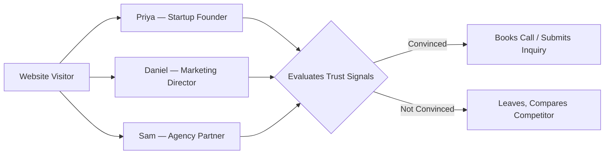
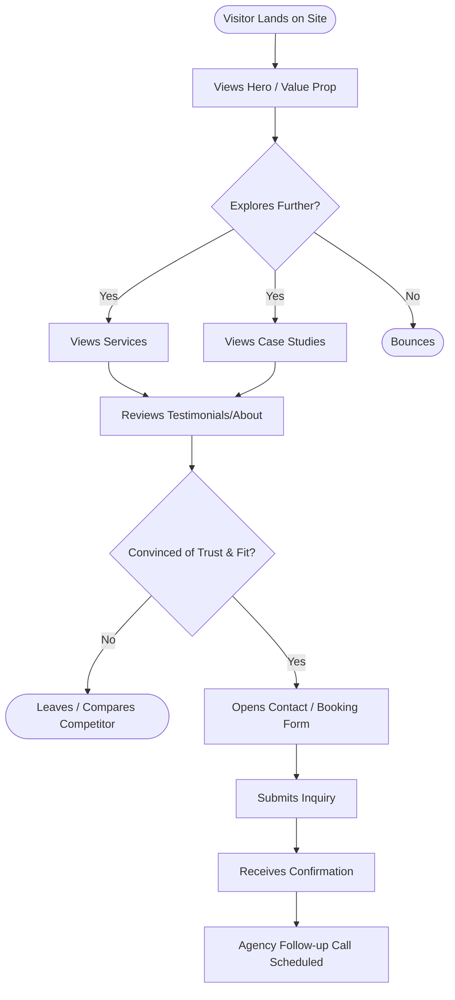
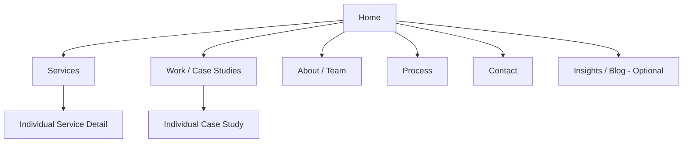

# Product Requirements Document

## Freelance Agency Website — "Trust-First" Platform

| Field          | Value                                                                  |
| -------------- | ---------------------------------------------------------------------- |
| Document Owner | Chief Product Officer                                                  |
| Status         | Draft v1.0 — Ready for Review                                          |
| Product        | Marketing & Client-Acquisition Website for a Freelance/Boutique Agency |
| Last Updated   | July 2026                                                              |

> **Assumptions stated upfront:** No prior discovery call took place for this PRD. Where specifics (team size, exact services, budget, tech stack) were not provided, this document uses industry-standard defaults for a small (1–10 person) freelance/boutique agency offering web & product design/development services, and flags each assumption inline so it can be corrected without re-deriving the rest of the document.

---

## 1. Executive Summary

This PRD defines the requirements for a new marketing and client-acquisition website for a freelance/boutique agency. The site's core job is to convert visitors — prospective clients evaluating multiple vendors — into qualified leads by establishing **trust and authenticity** faster than competitors, without relying on generic "trendy agency" visual clichés (gradient blobs, stock photography, exaggerated animation).

The site is not a product in the SaaS sense; it is a **conversion-focused credibility asset**. Success is measured by inbound lead quality and volume, not by engagement metrics like session count. The visual direction (dark, restrained, single-accent-color "midnight terminal" aesthetic) is intended to differentiate the agency from templated competitors and signal seniority and craft.

---

## 2. Vision

To be the first website a prospective client visits where they think: _"These people clearly know what they're doing — I don't need to keep shopping."_

---

## 3. Mission

Build a website that earns trust through clarity, evidence, and restraint — replacing sales language with proof (case studies, process transparency, real outcomes) — and converts qualified visitors into discovery calls or project inquiries within one visit.

---

## 4. Business Goals

| Goal              | Description                                                                 | Target                                               |
| ----------------- | --------------------------------------------------------------------------- | ---------------------------------------------------- |
| Lead generation   | Drive qualified inbound inquiries via contact/booking form                  | ≥ 15 qualified leads/month by Month 3                |
| Positioning       | Establish premium/boutique positioning vs. commodity freelance marketplaces | Avg. project value increase of 20% YoY               |
| Trust signal      | Reduce sales-cycle friction caused by credibility doubt                     | Reduce time-to-first-call by 30%                     |
| Brand consistency | Single source of truth for agency identity across channels                  | 100% of proposals/decks reuse site design system     |
| SEO foundation    | Organic discovery for service + case-study keywords                         | Top 10 ranking for 5 target keywords within 6 months |

---

## 5. Market Opportunity

- The freelance/agency services market is fragmented between two poles: **commodity marketplaces** (Fiverr, Upwork — low trust, price-driven) and **large agencies** (high trust, high cost, slow). A boutique agency with a polished, credible web presence can capture clients who want senior-level craft without enterprise-agency overhead.
- Buyers increasingly research vendors entirely online before any human contact — the website is frequently the **only** trust signal available before a sales call.
- "Overly trendy" agency sites (glassmorphism, exaggerated motion, stock illustration) have become a negative signal among sophisticated B2B buyers, who now associate that aesthetic with templated, low-craft vendors. A restrained, editorial, evidence-first design is a genuine differentiator, not just an aesthetic preference.

---

## 6. Target Audience

| Segment   | Description                                                                            | Assumption flag              |
| --------- | -------------------------------------------------------------------------------------- | ---------------------------- |
| Primary   | Founders / marketing leads at seed–Series B startups needing web/product design or dev | Assumed — confirm actual ICP |
| Secondary | SMB owners needing a professional web presence                                         | Assumed                      |
| Tertiary  | Other agencies seeking white-label/overflow partners                                   | Assumed                      |

---

## 7. User Personas

| Persona    | Role                      | Goals                                        | Frustrations                                 | Decision Driver                            |
| ---------- | ------------------------- | -------------------------------------------- | -------------------------------------------- | ------------------------------------------ |
| Priya, 32  | Startup Founder           | Ship a credible product fast, limited budget | Burned by unreliable freelancers before      | Case studies, clear process, fast response |
| Daniel, 41 | Marketing Director at SMB | Needs a reliable long-term vendor            | Tired of agencies overpromising              | Testimonials, transparent pricing signals  |
| Sam, 29    | Partner at a small agency | Needs overflow capacity/white-label partner  | Needs to trust quality without micromanaging | Portfolio depth, communication clarity     |

---

## 8. Pain Points

| Pain Point                       | Current Experience                             | Impact                                   |
| -------------------------------- | ---------------------------------------------- | ---------------------------------------- |
| Can't verify credibility quickly | Generic "we're the best" copy with no proof    | Visitor bounces, compares elsewhere      |
| Unclear process/pricing          | No visibility into how engagements work        | Increases perceived risk, stalls inquiry |
| Templated look-and-feel          | Overused trendy design patterns feel low-craft | Undermines premium positioning           |
| No easy path to contact          | Buried or multi-step contact forms             | Lost leads                               |
| No social proof                  | Missing client logos/testimonials/outcomes     | Lower conversion, longer sales cycle     |

---

## 9. Competitive Analysis

| Competitor Type               | Example                         | Strengths                  | Weaknesses                                                  | Our Differentiation                                           |
| ----------------------------- | ------------------------------- | -------------------------- | ----------------------------------------------------------- | ------------------------------------------------------------- |
| Marketplace                   | Upwork / Fiverr                 | Volume, price transparency | Commodity feel, no trust in individual vendor               | Curated, single-brand credibility                             |
| Large Agency                  | Local/global dev shops          | High trust, big portfolios | Slow, expensive, impersonal                                 | Boutique speed + senior-level personal attention              |
| Templated Freelancer Sites    | Typical portfolio-builder sites | Fast to launch             | Look identical to hundreds of others, low differentiation   | Distinct, restrained visual identity + evidence-first content |
| Trendy Startup-style Agencies | Various boutique studios        | Modern visual appeal       | Can feel style-over-substance, distracting motion/gradients | Modern but restrained — "confident, not loud"                 |

---

## 10. Functional Requirements

| ID    | Requirement                                                                                  | Priority |
| ----- | -------------------------------------------------------------------------------------------- | -------- |
| FR-1  | Homepage communicating value proposition, proof, and clear CTA above the fold                | Must     |
| FR-2  | Services section detailing offerings and scope boundaries                                    | Must     |
| FR-3  | Case studies / portfolio with outcome-oriented storytelling (problem → approach → result)    | Must     |
| FR-4  | Client testimonials with attribution (name, role, company)                                   | Must     |
| FR-5  | About/Team page establishing real people behind the agency                                   | Must     |
| FR-6  | Process page explaining engagement stages                                                    | Should   |
| FR-7  | Contact / inquiry form with lead qualification fields (budget range, project type, timeline) | Must     |
| FR-8  | Calendar booking integration for discovery calls                                             | Should   |
| FR-9  | Responsive design across mobile, tablet, desktop                                             | Must     |
| FR-10 | Basic CMS or structured content source for case studies/testimonials updates                 | Should   |
| FR-11 | SEO metadata, sitemap, structured data for services/organization                             | Must     |
| FR-12 | Analytics + lead-source tracking                                                             | Must     |
| FR-13 | Legal pages (Privacy Policy, Terms)                                                          | Must     |
| FR-14 | Newsletter/insights signup (optional trust-building content channel)                         | Could    |

---

## 11. Non-Functional Requirements

| ID    | Category        | Requirement                                                                       |
| ----- | --------------- | --------------------------------------------------------------------------------- |
| NFR-1 | Performance     | Largest Contentful Paint < 2.5s on 4G; Lighthouse Performance score ≥ 90          |
| NFR-2 | Accessibility   | WCAG 2.1 AA compliance (contrast, keyboard nav, alt text)                         |
| NFR-3 | SEO             | Semantic HTML, meta tags, Open Graph, sitemap.xml, robots.txt                     |
| NFR-4 | Security        | HTTPS enforced, form spam protection (e.g., honeypot/CAPTCHA), no exposed secrets |
| NFR-5 | Reliability     | 99.9% uptime target                                                               |
| NFR-6 | Maintainability | Component-based front end; design tokens sourced from a single design system file |
| NFR-7 | Scalability     | Static/JAMstack-friendly architecture to support traffic spikes at low cost       |
| NFR-8 | Browser Support | Latest 2 versions of Chrome, Safari, Firefox, Edge                                |
| NFR-9 | Privacy         | GDPR/CCPA-aligned data handling for form submissions                              |

---

## 12. User Stories & Acceptance Criteria

| ID   | User Story                                                                                                                                   | Acceptance Criteria                                                                                                              |
| ---- | -------------------------------------------------------------------------------------------------------------------------------------------- | -------------------------------------------------------------------------------------------------------------------------------- |
| US-1 | As a prospective client, I want to immediately understand what the agency does and for whom, so I can quickly decide if it's relevant to me. | Homepage hero communicates offer + audience within first viewport; no scrolling required to understand core value prop.          |
| US-2 | As a prospective client, I want to see proof of past work and outcomes, so I can assess quality before contacting the agency.                | At least 3 case studies visible with problem/approach/result structure and, where available, quantified outcomes.                |
| US-3 | As a prospective client, I want to read testimonials from real clients, so I can trust the agency's claims.                                  | Testimonials display name, role, and company (or explicit permissioned anonymization); no unattributed quotes.                   |
| US-4 | As a prospective client, I want a simple way to start a conversation, so I don't abandon the process due to friction.                        | Contact form is reachable within 1 click from any page; form has ≤ 6 required fields; confirmation message/page shown on submit. |
| US-5 | As a mobile user, I want the site to work well on my phone, so I can browse and inquire on the go.                                           | All core flows (browse services, view case study, submit form) fully functional and legible on a 375px viewport.                 |
| US-6 | As a returning visitor/partner, I want to understand the engagement process, so I know what working together looks like.                     | Process page or section lists discrete stages (e.g., Discovery → Proposal → Build → Delivery) with brief descriptions.           |
| US-7 | As the agency owner, I want to track where leads come from, so I can evaluate marketing channel effectiveness.                               | Analytics captures UTM/source data on form submissions; dashboard or export available.                                           |

---

## 13. Primary User Flow

---

## 14. Information Architecture

---

## 15. KPIs

| KPI                         | Definition                            | Target                      |
| --------------------------- | ------------------------------------- | --------------------------- |
| Lead conversion rate        | Form submissions ÷ unique visitors    | ≥ 2.5%                      |
| Qualified lead rate         | Qualified leads ÷ total submissions   | ≥ 50%                       |
| Avg. time to first response | Time from inquiry to agency reply     | < 24 hours                  |
| Bounce rate                 | Single-page sessions ÷ total sessions | < 55%                       |
| Organic traffic growth      | MoM organic session growth            | +10% MoM for first 6 months |
| Page load performance       | Lighthouse performance score          | ≥ 90                        |
| Case study engagement       | Avg. time on case study pages         | > 60 seconds                |

---

## 16. MVP Scope

| Included in MVP       | Notes                                      |
| --------------------- | ------------------------------------------ |
| Homepage              | Hero, value prop, proof strip, primary CTA |
| Services overview     | 3–5 core service offerings                 |
| 3–5 Case studies      | Problem/approach/result format             |
| About/Team            | Real photos/bios, no stock imagery         |
| Contact form          | With lead-qualification fields             |
| Responsive design     | Mobile, tablet, desktop                    |
| Basic SEO setup       | Metadata, sitemap, OG tags                 |
| Analytics integration | Source/lead tracking                       |

**Explicitly out of MVP scope:** blog/insights content engine, client portal/login, multi-language support, live chat, calendar auto-booking (can launch with a simple "request a call" form instead).

---

## 17. Phase 2

| Feature                               | Rationale                                               |
| ------------------------------------- | ------------------------------------------------------- |
| Calendar booking integration          | Reduces back-and-forth scheduling friction              |
| Insights/blog section                 | Supports SEO and thought-leadership positioning         |
| Lightweight CMS for case studies      | Reduces dependency on developer for content updates     |
| Client portal (project status, files) | Improves retention/experience for active clients        |
| Pricing/packages page                 | If sales data shows buyers want upfront pricing signals |
| Live chat or async video intro        | Additional trust-building touchpoint                    |

---

## 18. Risks

| Risk                                                                                         | Likelihood | Impact | Mitigation                                                                                |
| -------------------------------------------------------------------------------------------- | ---------- | ------ | ----------------------------------------------------------------------------------------- |
| Design restraint reads as "unfinished" rather than "premium" if not executed with high craft | Medium     | High   | Strong typography/spacing discipline; user testing before launch                          |
| Low initial case study count undermines credibility                                          | Medium     | High   | Prioritize 3 strong case studies over many weak ones; consider anonymized proof if needed |
| Contact form spam reduces lead quality                                                       | Medium     | Medium | Add spam protection, qualification fields                                                 |
| Site underperforms on mobile due to heavy typography/animation choices                       | Medium     | Medium | Mobile-first QA, performance budgets                                                      |
| SEO takes longer than expected to show results                                               | High       | Medium | Set realistic KPI timelines (6 month horizon), don't over-index early on organic traffic  |

---

## 19. Constraints

| Constraint           | Detail                                                                                                           |
| -------------------- | ---------------------------------------------------------------------------------------------------------------- |
| Team size            | Assumed small (1–10 person) agency — limited content production bandwidth                                        |
| Budget               | Assumed lean/bootstrapped — favors static/JAMstack architecture over custom backend                              |
| Timeline             | Assumed need for fast MVP launch (weeks, not months)                                                             |
| Content availability | Case studies/testimonials must be sourced/written before launch — content, not code, is the likely critical path |

---

## 20. Future Features

| Feature                            | Description                                              |
| ---------------------------------- | -------------------------------------------------------- |
| Interactive project cost estimator | Lightweight tool to qualify leads by budget upfront      |
| Client success dashboard           | Public or gated metrics dashboard building further trust |
| Referral/partner program page      | Formalizes agency-to-agency referral pipeline            |
| Multi-language support             | If expanding to non-English-speaking markets             |
| Video case studies                 | Higher-trust format than text-only case studies          |

---

## Appendix: Open Questions for Stakeholder Confirmation

1. What are the actual core services being offered (confirm beyond assumed web/product design & dev)?
2. How many real case studies/testimonials exist today, and can client permission be obtained to publish them?
3. Is there a target budget/timeline for MVP launch?
4. Should pricing be shown publicly, or gated behind a conversation?
5. Confirm target ICP (startup founders vs. SMBs vs. other agencies) — this materially changes tone and proof points.
