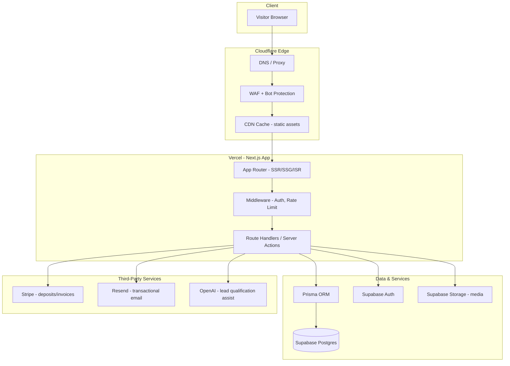
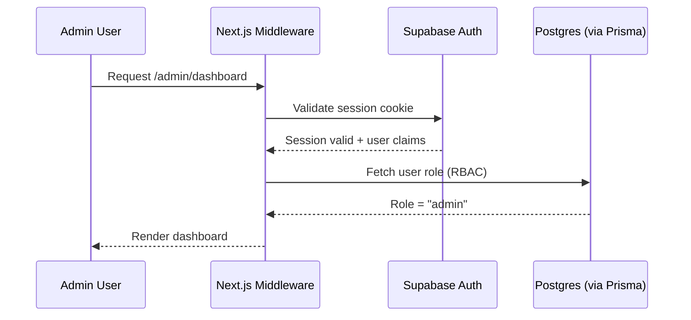
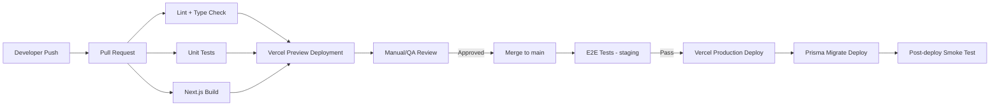
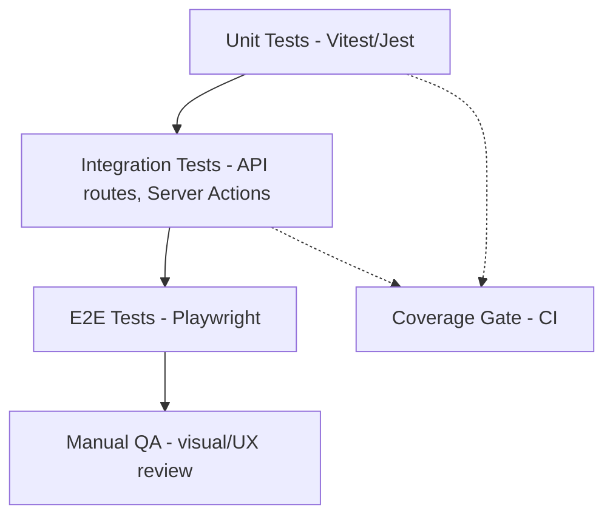

# Technical Requirements Document

## Freelance Agency Website — "Trust-First" Platform

| Field          | Value                                                                                                                                                                   |
| -------------- | ----------------------------------------------------------------------------------------------------------------------------------------------------------------------- |
| Document Owner | Engineering / CTO Function                                                                                                                                              |
| Status         | Draft v1.0 — Derived from Approved PRD v1.0                                                                                                                             |
| Stack          | Next.js, TypeScript, Tailwind, shadcn/ui, Supabase, Prisma, PostgreSQL, Vercel, Cloudflare, Stripe, Resend, OpenAI, Framer Motion, TanStack Query, React Hook Form, Zod |
| Last Updated   | July 2026                                                                                                                                                               |

> This TRD translates the approved PRD's functional/non-functional requirements into an implementable, production-ready technical spec. Stripe and OpenAI are included per the required stack; this document scopes their MVP usage narrowly (Stripe for optional deposit/invoice collection, OpenAI for an optional lead-qualification assistant) since the PRD's MVP is primarily a marketing/lead-gen site, not a transactional app. Both are marked **Phase 2-ready, MVP-optional** where relevant so scope stays honest.

---

## 1. Architecture Overview

The system is a JAMstack-leaning, server-rendered Next.js application deployed on Vercel, with Cloudflare in front for DNS/CDN/WAF, Supabase (Postgres) as the data layer accessed via Prisma, and third-party services for email, payments, and AI-assisted lead qualification.



### Architectural Principles

- **Server-first rendering:** Marketing pages (Home, Services, Case Studies, About) use Static Site Generation (SSG) with Incremental Static Regeneration (ISR) for near-zero latency and strong SEO. Authenticated/admin routes use SSR.
- **Thin client, thick edge:** Cloudflare handles caching, bot mitigation, and DDoS protection before requests reach Vercel.
- **Single source of truth for data:** Prisma schema is canonical; Supabase Postgres is the only system of record.
- **Composable services, not a monolith:** Stripe, Resend, OpenAI are integrated as isolated service modules behind internal interfaces, so any one can be swapped without touching core business logic.

---

## 2. Folder Structure

```
agency-website/
├── src/
│   ├── app/                        # Next.js App Router
│   │   ├── (marketing)/             # Public marketing routes group
│   │   │   ├── page.tsx              # Home
│   │   │   ├── services/
│   │   │   ├── work/
│   │   │   │   └── [slug]/           # Case study detail
│   │   │   ├── about/
│   │   │   ├── process/
│   │   │   └── contact/
│   │   ├── (admin)/                 # Authenticated admin routes group
│   │   │   ├── dashboard/
│   │   │   ├── leads/
│   │   │   ├── case-studies/
│   │   │   └── settings/
│   │   ├── api/                     # Route handlers (webhooks, integrations)
│   │   │   ├── contact/route.ts
│   │   │   ├── stripe/webhook/route.ts
│   │   │   ├── resend/route.ts
│   │   │   └── ai/qualify/route.ts
│   │   ├── layout.tsx
│   │   └── globals.css
│   ├── components/
│   │   ├── ui/                      # shadcn/ui primitives
│   │   ├── marketing/                # Hero, CaseStudyCard, TestimonialCard, etc.
│   │   └── admin/                    # Admin-only components
│   ├── lib/
│   │   ├── prisma.ts                  # Prisma client singleton
│   │   ├── supabase/                  # Supabase client (server/client variants)
│   │   ├── auth.ts                    # Auth helpers, session utilities
│   │   ├── rbac.ts                    # Role/permission checks
│   │   ├── validators/                # Zod schemas
│   │   ├── stripe.ts
│   │   ├── resend.ts
│   │   ├── openai.ts
│   │   └── utils.ts
│   ├── hooks/                       # Custom React hooks (TanStack Query wrappers)
│   ├── server/
│   │   ├── actions/                  # Server Actions (mutations)
│   │   └── services/                 # Business logic layer (leads, case studies)
│   ├── types/                       # Shared TypeScript types
│   └── styles/                      # Tailwind config extensions, design tokens
├── prisma/
│   ├── schema.prisma
│   └── migrations/
├── public/
├── tests/
│   ├── unit/
│   ├── integration/
│   └── e2e/
├── .env.example
├── middleware.ts
├── tailwind.config.ts
├── next.config.ts
└── tsconfig.json
```

**Rationale:** Route groups `(marketing)` and `(admin)` separate public SEO-critical pages from authenticated internal tooling without affecting URL structure. `server/services` isolates business logic from route handlers so logic is testable independent of Next.js request/response objects.

---

## 3. Coding Standards

| Area           | Standard                                                                                                                          |
| -------------- | --------------------------------------------------------------------------------------------------------------------------------- |
| Language       | TypeScript strict mode (`strict: true`), no implicit `any`                                                                        |
| Linting        | ESLint with `next/core-web-vitals` + `typescript-eslint` recommended rulesets                                                     |
| Formatting     | Prettier, enforced via pre-commit hook                                                                                            |
| Naming         | `PascalCase` for components/types, `camelCase` for functions/variables, `kebab-case` for file/folder names except component files |
| Components     | Functional components only; server components by default, `"use client"` only when interactivity/state is required                |
| Validation     | All external input (forms, API payloads, webhooks) validated with Zod before use — no untyped `any` from request bodies           |
| Commits        | Conventional Commits (`feat:`, `fix:`, `chore:`, etc.) enforced via commitlint                                                    |
| Imports        | Absolute imports via `@/` path alias; no deep relative `../../../` chains                                                         |
| Error handling | No silent catches — errors are logged with context and either surfaced or explicitly justified in a comment                       |
| Component size | Components exceeding ~150 lines or mixing concerns (data fetching + heavy UI logic) should be decomposed                          |

---

## 4. Authentication

- **Provider:** Supabase Auth (email/password + magic link for admin users). No end-user (visitor) authentication is required for MVP — the public site is unauthenticated by design.
- **Admin authentication:** Email/password with mandatory 2FA (TOTP) for all admin accounts, enforced at the Supabase Auth policy level.
- **Session handling:** Supabase session tokens stored in secure, `httpOnly`, `SameSite=Lax` cookies; refreshed via Supabase SSR helpers in Next.js middleware.
- **Password policy:** Minimum 12 characters, breached-password check via Supabase Auth's built-in protections.



---

## 5. Authorization & RBAC

| Role                 | Description               | Permissions                                                               |
| -------------------- | ------------------------- | ------------------------------------------------------------------------- |
| `owner`              | Agency principal          | Full access: users, billing, content, leads, settings                     |
| `admin`              | Core team member          | Manage content, leads, case studies; no billing/user management           |
| `editor`             | Contractor/content editor | Create/edit case studies and services content; no lead or settings access |
| `viewer`             | Read-only stakeholder     | View dashboard/analytics only                                             |
| `visitor` (implicit) | Public/unauthenticated    | Access public marketing pages and contact form only                       |

**Enforcement model:**

- Role stored on the `User` table (via Prisma), synced with Supabase Auth `user_id`.
- Row-Level Security (RLS) policies enabled on all Supabase tables as the **last line of defense**, in addition to application-layer checks — no table is left relying solely on app-layer authorization.
- A single `can(user, action, resource)` utility in `lib/rbac.ts` centralizes permission checks; no permission logic duplicated inline across routes/components.
- Server Actions and Route Handlers re-validate role server-side on every mutation — client-side role checks are UX-only, never security boundaries.

---

## 6. State Management

| Concern                                      | Tool                           | Notes                                                                                                                                                   |
| -------------------------------------------- | ------------------------------ | ------------------------------------------------------------------------------------------------------------------------------------------------------- |
| Server state (leads, case studies, settings) | TanStack Query                 | All reads/writes to backend data go through Query/Mutation hooks with defined query keys                                                                |
| Form state                                   | React Hook Form + Zod resolver | Used for contact form, admin content forms                                                                                                              |
| Local/UI state                               | React `useState`/`useReducer`  | Component-local only (modals, toggles, filters)                                                                                                         |
| Global client state                          | Avoided by default             | If unavoidable (e.g., theme), use React Context sparingly — no global client store (Redux/Zustand) planned for MVP given limited client-side complexity |

**Query key convention:** `[entity, id?, filters?]` — e.g., `["case-studies"]`, `["case-studies", slug]`, `["leads", { status: "new" }]`.

---

## 7. Caching Strategy

| Layer                  | Mechanism                                             | TTL / Strategy                                                                                          |
| ---------------------- | ----------------------------------------------------- | ------------------------------------------------------------------------------------------------------- |
| CDN (Cloudflare)       | Edge cache for static assets, images, fonts           | Long TTL (1 year) with content-hashed filenames                                                         |
| Page-level (marketing) | Next.js ISR                                           | Revalidate case studies/services every 60–300s or on-demand via webhook when content changes            |
| API/data (admin)       | TanStack Query cache                                  | `staleTime` 30s for lead lists, `staleTime` 5 min for mostly-static content (services)                  |
| Database               | Prisma + Postgres query optimization, indexed lookups | No separate cache layer (e.g., Redis) required at MVP scale                                             |
| On-demand revalidation | Next.js `revalidatePath`/`revalidateTag`              | Triggered from admin content mutations so published changes go live immediately without a full redeploy |

---

## 8. API Design

- **Pattern:** Next.js Route Handlers for webhooks/integrations (`/api/*`) + Server Actions for internal admin mutations (form submissions, content edits) — avoids building/maintaining a separate REST layer for internal use.
- **Public contact form submission:** `POST /api/contact` — validated via Zod schema, rate-limited, writes lead to Postgres, triggers Resend confirmation email, optionally triggers OpenAI lead-qualification scoring (Phase 2-ready, MVP-optional).
- **Webhooks:** `POST /api/stripe/webhook` (signature-verified), for Phase 2 deposit/invoice flows.
- **Response conventions:** JSON responses use a consistent envelope: `{ data, error }`. HTTP status codes used correctly (400 validation, 401 unauthenticated, 403 unauthorized, 429 rate-limited, 500 unexpected).
- **Versioning:** Not required at MVP (single consumer — the site itself); if a public API is added later, version via `/api/v1/`.

| Endpoint                           | Method | Auth                  | Purpose                                                  |
| ---------------------------------- | ------ | --------------------- | -------------------------------------------------------- |
| `/api/contact`                     | POST   | Public (rate-limited) | Submit lead inquiry                                      |
| `/api/ai/qualify`                  | POST   | Internal/admin        | Score/summarize a lead using OpenAI (Phase 2-optional)   |
| `/api/stripe/webhook`              | POST   | Stripe signature      | Handle payment/invoice events (Phase 2)                  |
| `/api/resend`                      | POST   | Internal              | Trigger transactional email (confirmation, notification) |
| Server Actions (`/server/actions`) | —      | Session + RBAC        | Admin CRUD for case studies, services, leads             |

---

## 9. Logging

| Type             | Tool/Approach                                                        | Detail                                                                                                                    |
| ---------------- | -------------------------------------------------------------------- | ------------------------------------------------------------------------------------------------------------------------- |
| Application logs | Vercel's built-in logging + structured `console` output (JSON)       | Every log includes `timestamp`, `level`, `route`, `requestId`, `userId` (if authenticated)                                |
| Error tracking   | Sentry (Vercel + Next.js SDK)                                        | Captures unhandled exceptions client and server-side, source-mapped                                                       |
| Audit logging    | Dedicated `AuditLog` Postgres table                                  | Records admin actions (content edits, role changes, lead status changes) with actor, action, timestamp, before/after diff |
| Webhook logging  | Persisted raw payload + processing result for Stripe/Resend webhooks | Enables replay/debugging without re-triggering third parties                                                              |

No PII beyond what's operationally necessary is logged in plaintext; emails/names in logs are treated as sensitive and access-restricted.

---

## 10. CI/CD



- **Pipeline:** GitHub Actions for lint/type-check/unit tests + Vercel's native Git integration for build/preview/production deployments.
- **Branch strategy:** `main` = production, feature branches → PR → preview deploy → review → merge.
- **Database migrations:** Prisma migrations run as a distinct CI step (`prisma migrate deploy`) gated behind production deploy approval — never run automatically on preview branches against production data.
- **Rollback:** Vercel instant rollback to prior deployment; database migrations designed to be backward-compatible (additive) where feasible to avoid destructive rollback scenarios.

---

## 11. Monitoring

| Layer              | Tool                                                              | Signals                                                  |
| ------------------ | ----------------------------------------------------------------- | -------------------------------------------------------- |
| Uptime             | Vercel Monitoring / external uptime checker (e.g., Better Uptime) | 99.9% uptime target per PRD NFR-5                        |
| Performance        | Vercel Analytics + Web Vitals reporting                           | LCP, CLS, INP tracked against NFR-1 budget               |
| Errors             | Sentry                                                            | Real-time alerting on error rate spikes                  |
| Business metrics   | Product analytics (e.g., PostHog) + internal `Lead` table queries | Conversion rate, funnel drop-off per PRD KPIs            |
| Third-party health | Status checks on Stripe/Resend/OpenAI/Supabase                    | Alert on integration failures (e.g., failed email sends) |

Alerting thresholds tie back directly to PRD KPIs (e.g., alert if lead conversion drops below a defined floor week-over-week, not just on hard errors).

---

## 12. Security

| Area                | Control                                                                                                                                                            |
| ------------------- | ------------------------------------------------------------------------------------------------------------------------------------------------------------------ |
| Transport           | HTTPS enforced everywhere via Cloudflare + Vercel; HSTS enabled                                                                                                    |
| Input validation    | Zod schemas on all external input; no raw client input reaches Prisma/DB queries                                                                                   |
| SQL injection       | Mitigated structurally — Prisma parameterizes all queries, no raw SQL string concatenation                                                                         |
| XSS                 | React's default escaping; `dangerouslySetInnerHTML` disallowed except for sanitized rich-text (case study content) run through a sanitizer (e.g., `sanitize-html`) |
| CSRF                | Server Actions use Next.js's built-in origin-checking; cookies `SameSite=Lax`                                                                                      |
| Secrets             | All secrets in Vercel Environment Variables, never committed; `.env.example` documents required keys with no real values                                           |
| Rate limiting       | Cloudflare rate limiting + application-level limiting on `/api/contact` to prevent spam/abuse                                                                      |
| Bot protection      | Cloudflare WAF + Turnstile (or equivalent) on public contact form                                                                                                  |
| Dependency security | Automated dependency scanning (e.g., GitHub Dependabot) in CI                                                                                                      |
| Data access         | Supabase RLS as defense-in-depth beneath application RBAC (see Section 5)                                                                                          |
| Payment data        | Stripe handles all card data directly (Stripe Elements/Checkout) — no card data ever touches application servers (PCI SAQ-A scope only)                            |

---

## 13. SEO

| Requirement                | Implementation                                                                                                                 |
| -------------------------- | ------------------------------------------------------------------------------------------------------------------------------ |
| Metadata                   | Next.js `generateMetadata` per route — unique title/description per page and case study                                        |
| Structured data            | JSON-LD for `Organization`, `Service`, and `Article`/`CaseStudy` schema types                                                  |
| Sitemap                    | Auto-generated `sitemap.xml` via `next-sitemap`, updated on build/ISR revalidation                                             |
| Robots                     | `robots.txt` allowing marketing routes, disallowing `/admin`, `/api`                                                           |
| Canonical URLs             | Set explicitly per page to avoid duplicate-content issues                                                                      |
| Open Graph / Twitter cards | Set per page, with case-study-specific OG images                                                                               |
| Core Web Vitals            | Tracked against NFR-1 (LCP < 2.5s), directly impacts SEO ranking                                                               |
| Static rendering           | SSG/ISR for all indexable marketing pages ensures crawlable, fast-loading HTML (no client-only rendering for critical content) |

---

## 14. Accessibility

- Target: **WCAG 2.1 AA**, matching PRD NFR-2.
- shadcn/ui components (built on Radix primitives) used as the base for accessible interactive elements (dialogs, menus, forms) rather than custom-built equivalents.
- All images require descriptive `alt` text; decorative images use empty `alt=""`.
- Color contrast validated against the dark "midnight terminal" palette specifically — the single-accent-color system must be checked to ensure text-on-background contrast ratios meet AA at all defined text tokens.
- Full keyboard navigability for all interactive elements (nav, forms, modals); visible focus states required (no `outline: none` without a replacement focus style).
- Form errors (React Hook Form + Zod) announced via `aria-live` regions, not color alone.
- Motion (Framer Motion) respects `prefers-reduced-motion`; no motion-only conveyance of information.
- Automated accessibility testing (e.g., `axe-core`) integrated into CI as a non-blocking initial pass, escalating to blocking once baseline is clean.

---

## 15. Deployment

| Environment | Purpose                   | Branch           | URL pattern                  |
| ----------- | ------------------------- | ---------------- | ---------------------------- |
| Local       | Development               | any              | `localhost:3000`             |
| Preview     | Per-PR review             | feature branches | Vercel-generated preview URL |
| Staging     | Pre-production validation | `staging`        | `staging.<domain>`           |
| Production  | Live site                 | `main`           | `<domain>`                   |

- **Hosting:** Vercel (Next.js-native, handles SSR/ISR/edge functions).
- **DNS/CDN/Security:** Cloudflare in front of Vercel (proxied DNS, WAF, caching rules for static assets).
- **Database:** Supabase-managed Postgres, with automated daily backups and point-in-time recovery enabled.
- **Migrations:** Applied via CI as a gated step before production traffic is routed to new code (Section 10).

---

## 16. Environment Variables

| Variable                             | Purpose                               | Scope                                |
| ------------------------------------ | ------------------------------------- | ------------------------------------ |
| `DATABASE_URL`                       | Prisma/Postgres connection string     | Server                               |
| `DIRECT_URL`                         | Prisma direct connection (migrations) | Server                               |
| `NEXT_PUBLIC_SUPABASE_URL`           | Supabase project URL                  | Client + Server                      |
| `NEXT_PUBLIC_SUPABASE_ANON_KEY`      | Supabase public anon key              | Client + Server                      |
| `SUPABASE_SERVICE_ROLE_KEY`          | Supabase admin operations             | Server only, never exposed to client |
| `STRIPE_SECRET_KEY`                  | Stripe server operations              | Server only                          |
| `STRIPE_WEBHOOK_SECRET`              | Verify Stripe webhook signatures      | Server only                          |
| `NEXT_PUBLIC_STRIPE_PUBLISHABLE_KEY` | Stripe client SDK                     | Client                               |
| `RESEND_API_KEY`                     | Transactional email sending           | Server only                          |
| `OPENAI_API_KEY`                     | Lead qualification assistant          | Server only                          |
| `SENTRY_DSN`                         | Error tracking                        | Client + Server                      |
| `NEXT_PUBLIC_SITE_URL`               | Canonical site URL for metadata/OG    | Client + Server                      |
| `CLOUDFLARE_TURNSTILE_SECRET_KEY`    | Bot protection verification           | Server only                          |
| `NEXT_PUBLIC_TURNSTILE_SITE_KEY`     | Bot protection widget                 | Client                               |

All variables documented in `.env.example` with placeholder values; real values only ever set in Vercel's encrypted environment variable store, scoped per environment (Preview/Staging/Production).

---

## 17. Performance

| Target                      | Metric                                                                                                                     | Ties to PRD                                                                  |
| --------------------------- | -------------------------------------------------------------------------------------------------------------------------- | ---------------------------------------------------------------------------- |
| LCP < 2.5s                  | Largest Contentful Paint on 4G                                                                                             | NFR-1                                                                        |
| CLS < 0.1                   | Cumulative Layout Shift                                                                                                    | NFR-1                                                                        |
| INP < 200ms                 | Interaction to Next Paint                                                                                                  | NFR-1                                                                        |
| Lighthouse Performance ≥ 90 | Automated CI check on key routes                                                                                           | NFR-1, KPI (Section 15 of PRD)                                               |
| Image optimization          | `next/image` with responsive sizing, AVIF/WebP                                                                             | Reduces LCP risk from hero imagery                                           |
| Font loading                | `next/font` with self-hosted fonts, `font-display: swap`                                                                   | Avoids render-blocking web font requests                                     |
| Bundle size                 | Route-level code splitting, dynamic imports for heavy client components (Framer Motion sequences, admin dashboard charts)  | Keeps marketing pages lean since they're the SEO/conversion-critical surface |
| Animation performance       | Framer Motion animations use GPU-accelerated properties (`transform`, `opacity`) only, respecting `prefers-reduced-motion` | Avoids layout thrash                                                         |

---

## 18. Testing Strategy



| Layer             | Tool                                     | Scope                                                                                                                    |
| ----------------- | ---------------------------------------- | ------------------------------------------------------------------------------------------------------------------------ |
| Unit              | Vitest (or Jest)                         | Zod schemas, RBAC utility functions, business logic in `server/services`                                                 |
| Component         | React Testing Library                    | Form validation behavior, conditional rendering, accessibility roles                                                     |
| Integration       | Vitest + test DB (or Prisma test client) | Route Handlers and Server Actions against a test Postgres instance                                                       |
| E2E               | Playwright                               | Critical user flows: homepage → contact form submission → confirmation; admin login → create case study → verify publish |
| Accessibility     | `axe-core` (via Playwright or jest-axe)  | Automated AA checks on key pages                                                                                         |
| Performance       | Lighthouse CI                            | Automated performance budget checks on marketing routes in CI                                                            |
| Visual regression | Optional — Percy/Chromatic (Phase 2)     | Not required for MVP given rapid initial iteration                                                                       |

**Coverage gate:** Minimum 70% coverage on `lib/` and `server/` logic (business logic and validation), not enforced on presentational components where RTL/E2E provides better signal.

---

## Appendix: Traceability to PRD

| PRD Requirement                    | TRD Section(s)                                                       |
| ---------------------------------- | -------------------------------------------------------------------- |
| FR-7, FR-8 (Contact form, booking) | Sections 8 (API Design), 12 (Security — Turnstile/rate limiting)     |
| FR-9 (Responsive design)           | Section 17 (Performance)                                             |
| FR-10 (CMS/structured content)     | Sections 2 (Folder Structure — admin routes), 5 (RBAC — editor role) |
| FR-11 (SEO)                        | Section 13                                                           |
| FR-12 (Analytics)                  | Section 11 (Monitoring)                                              |
| NFR-1 (Performance)                | Section 17                                                           |
| NFR-2 (Accessibility)              | Section 14                                                           |
| NFR-4 (Security)                   | Section 12                                                           |
| NFR-5 (Reliability, 99.9% uptime)  | Section 11                                                           |
| NFR-9 (Privacy/GDPR)               | Sections 9 (Logging), 12 (Security)                                  |

---

## Open Questions for Engineering Kickoff

1. Confirm whether Stripe/OpenAI are needed at MVP launch or should be fully deferred to Phase 2 to reduce initial scope.
2. Confirm expected admin team size — affects whether full RBAC (5 roles) is needed at MVP or can start with `owner`/`editor` only.
3. Confirm whether a headless CMS (e.g., Sanity) is preferred over the custom Prisma-backed admin for case study content authoring.
4. Confirm analytics tool preference (PostHog vs. GA4 vs. Vercel Analytics only) for KPI tracking continuity with the PRD.
