# USER_FLOW.md

## Freelance Agency Website

Companion to PRD.md, TRD.md, DESIGN.md and DATABASE.md.

## 1. Visitor Journey

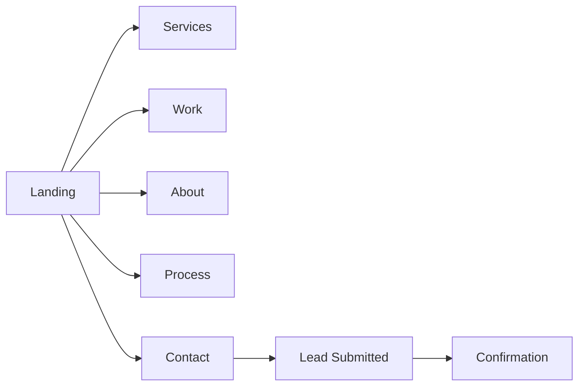

**Landing**

- Hero with primary CTA: **Book a Discovery Call**
- Secondary CTA: **View Case Studies**
- Scroll to Services, Process, Testimonials, FAQ.

Navigation:

- Logo → Home
- Services
- Work
- Process
- About
- Contact

---

## 2. Service Discovery

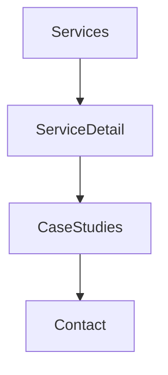

Buttons:

- Learn More
- Start Project
- View Related Work

---

## 3. Portfolio / Case Study

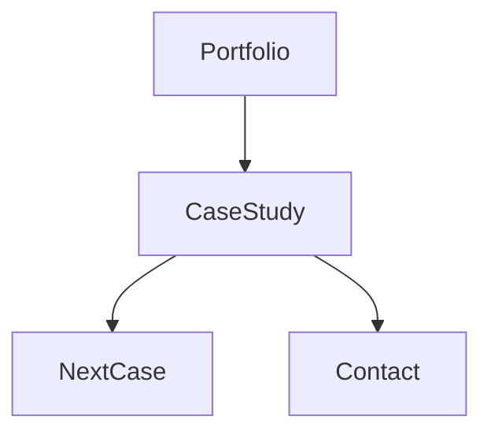

Screen sections:
Overview → Challenge → Solution → Results → Tech Stack → Testimonial → CTA.

Buttons:

- View Live
- Next Project
- Start Similar Project

---

## 4. Contact & Lead

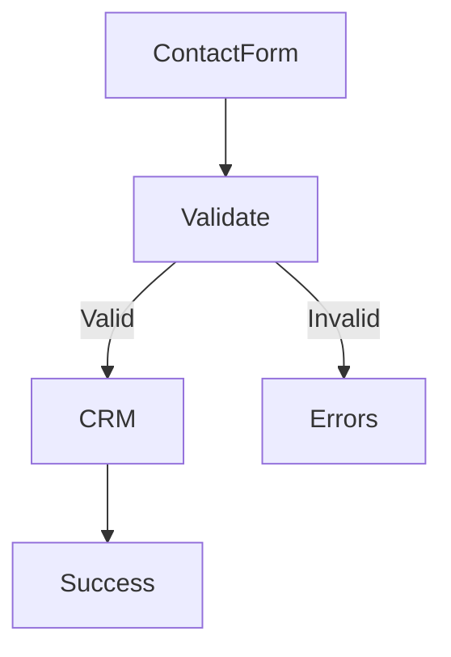

Fields:
Name, Email, Company, Budget, Timeline, Services, Message.

Buttons:

- Submit Inquiry
- Schedule Call

---

## 5. Discovery Call

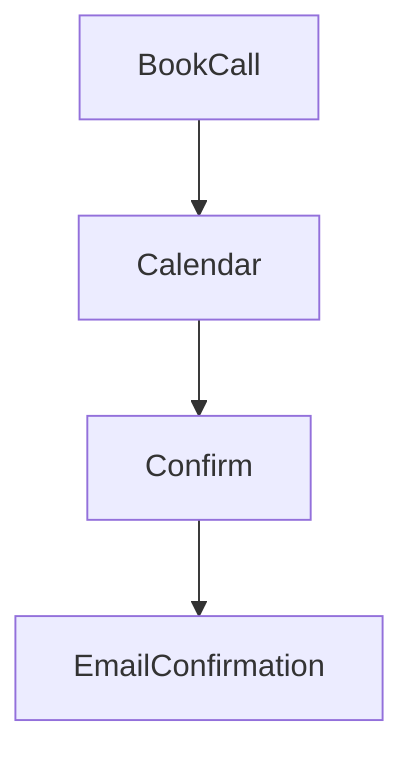

---

## 6. Authentication (Admin)

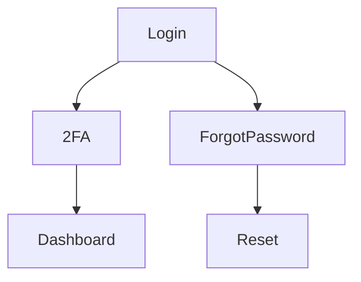

Buttons:
Login, Forgot Password, Reset Password, Logout.

---

## 7. Admin Dashboard

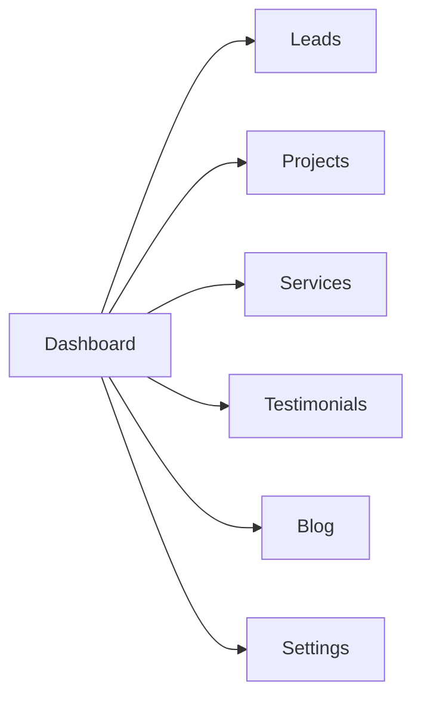

Widgets:

- New Leads
- Conversion Rate
- Recent Activity
- Website Metrics

---

## 8. Lead Management

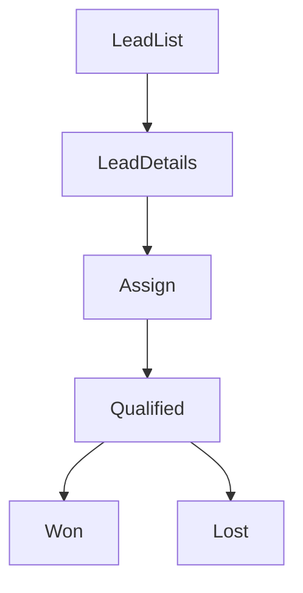

Buttons:
Assign, Archive, Email, Mark Won, Mark Lost.

---

## 9. Content Management

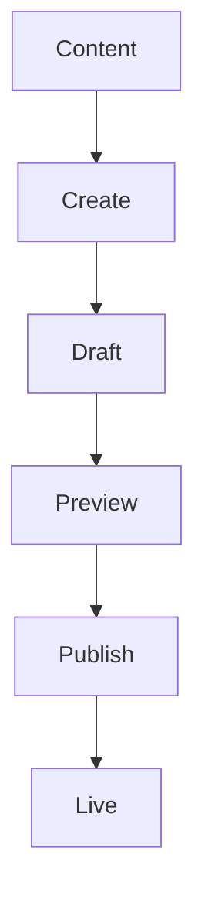

For Services, Case Studies, Blog and FAQ.

---

## 10. Settings

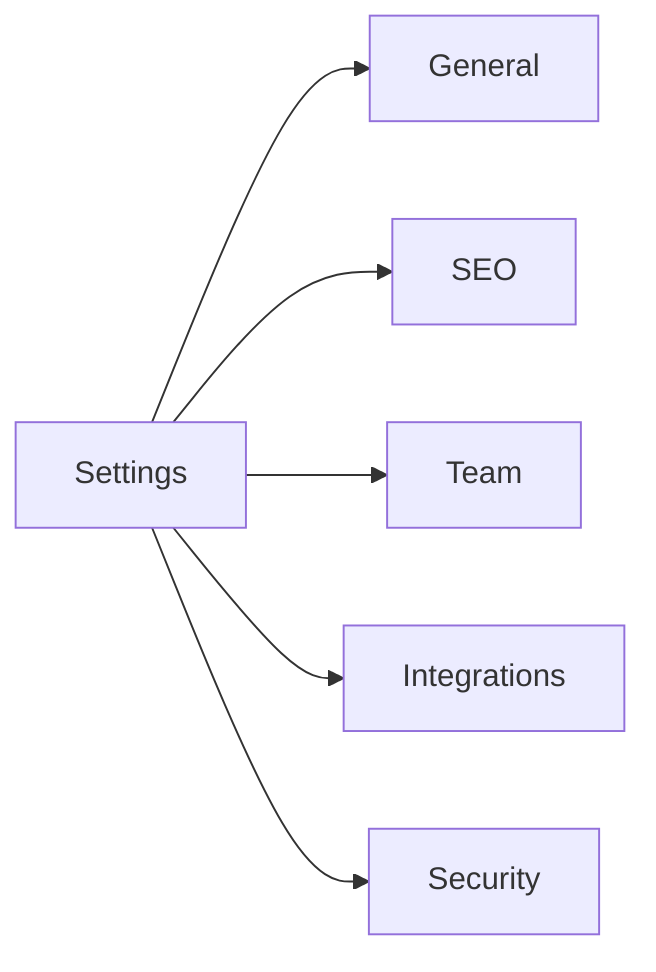

---

## 11. Error States

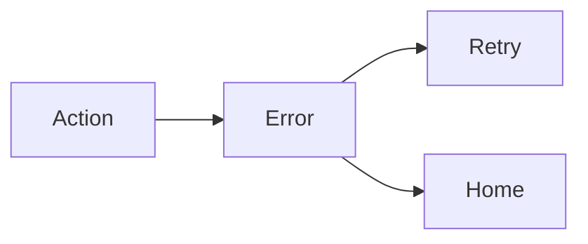

Buttons:
Retry, Back Home, Contact Support.

---

## 12. Loading States

- Skeleton hero
- Skeleton cards
- Button spinner
- Progressive image loading

---

## 13. Success States

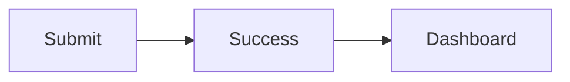

Examples:

- Lead submitted
- Project published
- Settings saved

---

## 14. Empty States

- No leads
- No case studies
- No testimonials
- No blog posts

CTA:
Create New / Add Content.

---

## 15. Permission Denied

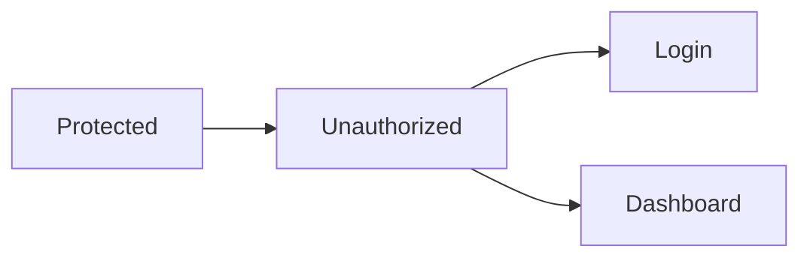

Buttons:
Login, Request Access.

## Global Navigation

Public:

- Home
- Services
- Work
- Process
- About
- Contact

Admin:

- Dashboard
- Leads
- Projects
- Content
- Analytics
- Settings
- Logout
